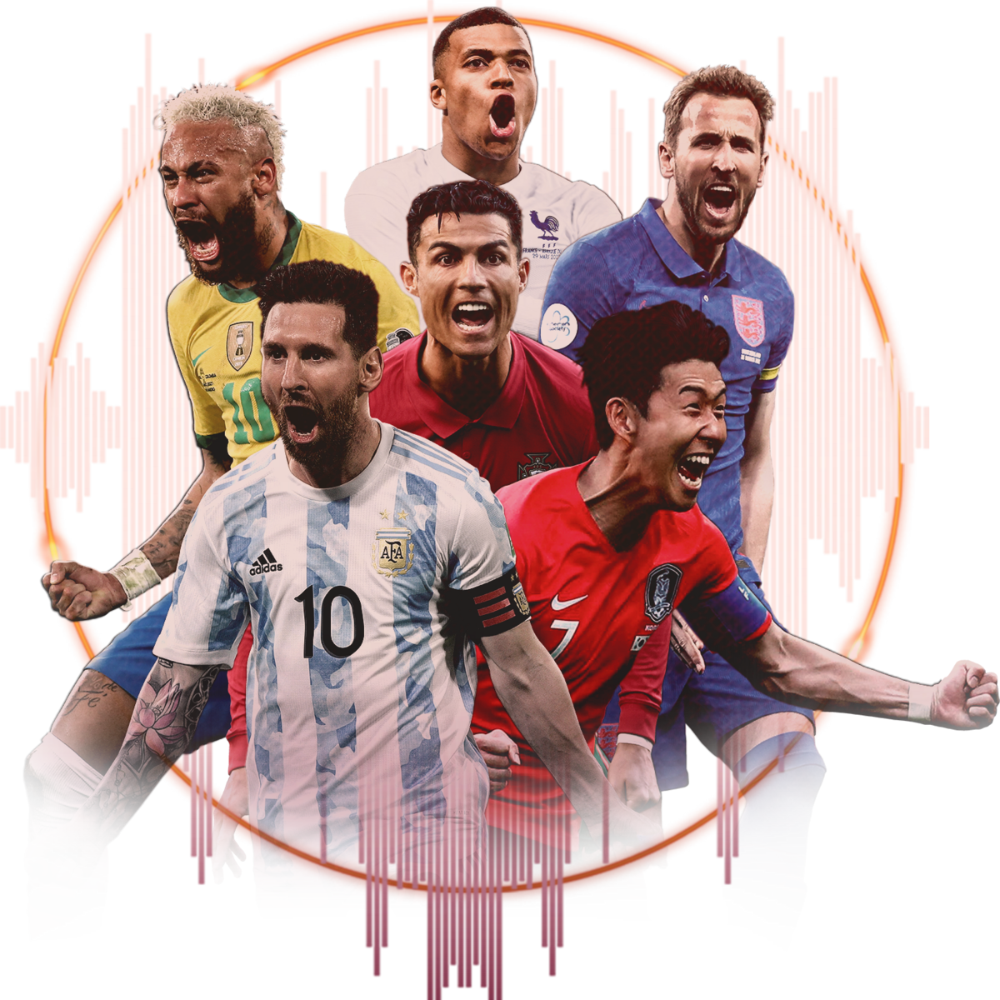

> This dataset is derived from [@soumendraprasad](https://www.kaggle.com/soumendraprasad)'s [broader image dataset](https://www.kaggle.com/datasets/soumendraprasad/fifa-2022-all-players-image-dataset) of all the players that participated in the [2022 Fifa World Cup](https://en.wikipedia.org/wiki/2022_FIFA_World_Cup). Many thanks to him for coming up with such a wonderful dataset.

## General Information

The FIFA World Cup is a professional football tournament held between national football teams, organised by FIFA. The 2022 FWC took place in Qatar from 20th November to 18th December 2022. Argentina were crowned the champions after winning the final against the defending champions France 4–2 on penalties following a 3–3 draw after extra time.

This is an image dataset of 45 of the most elite players that participated in the 2022 FWC. I tailored it to suit an ML project I am working on. The player selection is borne out of my personal opinions and biases, and does not necessarily reflect (current) consensus nor reality. (Yes, Eden Hazard, one of the greatest ever to grace the Premier League is in the dataset. 😎 No, Darwin Nunez isn't included; in case you missed the title, this is a dataset of the most elite players. 😉)

Unfortunately, since the parent dataset by nature only comprises teams that qualified for the World Cup, there are quite a few elite players that have been left out (sorry Zinchenko, Ødegaard, Salah, Osimhen, Haaland).

## Dataset Overview

- The dataset is contains 4 folders that represent different positions on the pitch, namely: _Goalkeepers_, _Defenders_, _Midfielders_ and _Forwards_.
- Each position folder contains several folders of the most elite players in that position.
- And each player folder contains up to 50 images of that player.

That will be all. Go forth and build cool things with the dataset.
